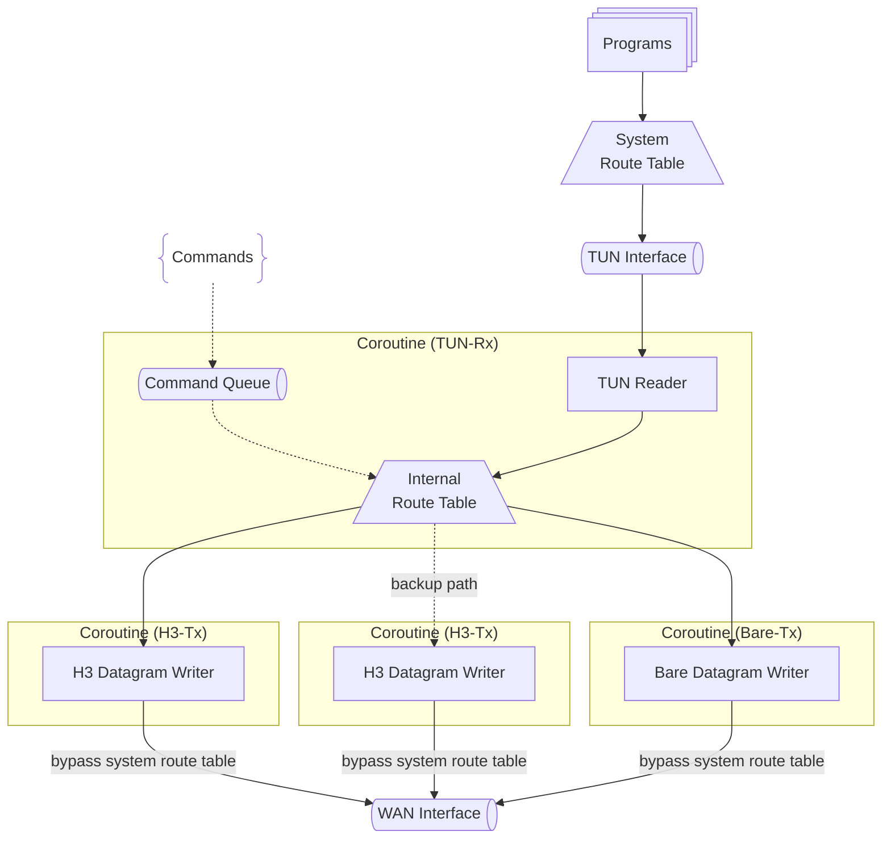
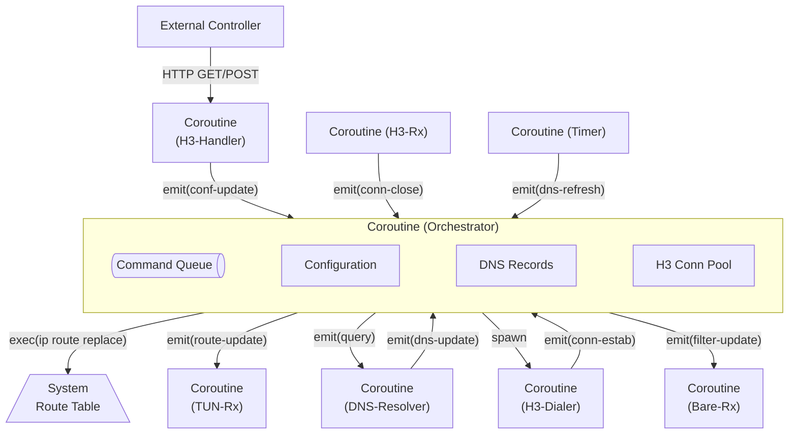

## Internals

Internals overview: runtime dependencies, guards against recursive routing and DNS resolution loops, coroutine layout for packet flow, route update strategy, and longest-prefix matching. Protocol/auth specifics live in `docs/protocol.md`.

### Dependencies

h3llo primarily depends on tun-rs and Cloudflare's tokio-quiche (HTTP/3 with DATAGRAM support enabled).

### Recursive Routing and DNS Resolution

Recursive routing and DNS resolution summary: probe WAN-facing interfaces (excluding the TUN) for DNS, HTTP/3, and BareUDP, bind sockets per interface when possible, and warn loudly while falling back to unbound sockets if probing or binding fails (risking recursive routing when default routes are overridden).

Why recursive routing happens: if h3llo installs the default route into the TUN and outbound sockets (DNS, HTTP/3, BareUDP) are not explicitly bound to a WAN-facing interface, their traffic can re-enter the tunnel and get forwarded again, creating loops and blocking connectivity. Binding per interface (or at least warning on fallback to unbound) avoids the TUN from becoming both source and sink of control traffic.

Binding workflow for HTTP/3, BareUDP, and DNS:
1. Pick the DNS interface: prefer `local.dns.bindif` when provided and present in probe results; warn and fall back to the first probed non-TUN interface when the preferred one is missing. If no interface is available or probing fails, log a warning and continue with an unbound DNS socket. Probing uses `ip route show match <local.dns.server>` on Linux while excluding the TUN.
2. DNS resolver coroutine: bind a UDP socket with `SO_BINDTODEVICE`, `IP_UNICAST_IF`, or `IP_BOUND_IF` when available. Every `local.dns.refresh` seconds (default `60`, minimum `30`; `0` disables the timer) enqueue a batched query of all hostnames. Resolve serially and stream each peer’s result back to the orchestrator via the DNS resolver’s command queue.
3. Transport binding: for each resolved IP (HTTP/3) or selected outbound IP (BareUDP), probe the WAN-facing interface excluding the TUN; bind transport sockets to that interface. HTTP/3 creates connections across the Cartesian product of DNS answers, `peers[].h3.endpoints`, and `peers[].h3.bindifs`; BareUDP binds one socket per outbound interface plus a dedicated listener socket. If probing or binding fails, warn and continue unbound.

### Thread Model

Thread model overview: h3llo schedules a coroutine per I/O source (TUN, each HTTP/3 connection, BareUDP endpoint) and uses MPSC queues to serialize cross-component communication; configuration updates flow from the controller into routing tables before affecting system routes.

**Inbound Datapath**

**Outbound Datapath**

**Control Path**

h3llo uses the tokio runtime to schedule coroutines and should rely on MPSC queues instead of locks to reduce async complexity, since MPSC queues explicitly linearize async operations.

Orchestrator responsibilities and invariants:
- Maintain the latest configuration snapshot, DNS cache, and H3 connection pool; receive commands from other coroutines through its MPSC queue.
- Stay fully async: handle config updates, DNS refresh results, connection close notifications, and timer ticks without blocking other commands.
- Spawn new coroutines (DNS resolver, H3 dialers) and push newly established H3 connections to the TUN-Rx coroutine for routing decisions.

Spawn a coroutine for every I/O reader (TUN-Rx, TUN-Tx, each H3 connection, BareUDP, DNS resolver). Each H3 connection owns its own Rx coroutine; each outbound interface for BareUDP owns a socket, plus one listener socket.

When configuration changes arrive (external controller POST or initialization), update the internal routing table first, then the system routing table. Dynamic reconfiguration flows through the orchestrator via command queues; transport rebuilds or filter updates happen after routing changes.

H3 connection pooling and selection:
- Build `a*b*c` HTTP/3 connections for each peer where `a =` DNS answers, `b = |peers[].h3.endpoints|`, and `c = |peers[].h3.bindifs|` (with auto-detected bindif yielding at most one entry).
- Deduplicate endpoints before dialing. Warn if more than 10 connections exist for a peer; otherwise maintain all connections in the pool.
- Prefer the earliest established connection until it disconnects or becomes invalid because its IP left the latest DNS result set or its interface is no longer within `bindifs`. Fall back to the next-most-recent connection; newly rebuilt connections sit at the end of the ordering.

DNS refresh loop:
- Every `local.dns.refresh` seconds (when nonzero), the DNS resolver coroutine batches all hostnames, resolves serially, and streams results to the orchestrator over its command queue.
- On changes (new IPs), the orchestrator spawns H3 dialers to create new connections and updates BareUDP filters; newly established connections flow back into the pool and are pushed to TUN-Rx.
- BareUDP keeps the full DNS answer set for filtering. On outbound path, choose the first answer as the destination, warn with the full set, and re-probe outbound interfaces and sockets when the chosen IP changes.

During packet forwarding, TUN-Rx chooses the active H3 connection for the peer based on the pool ordering above; it enqueues received IP packets into the TUN-Tx queue to keep TUN writes thread-safe.

Key flows:

- TUN Reader → internal route table lookup → H3/Bare datagram writer.
- H3/Bare datagram reader → queue → TUN Writer.
- Controller updates → internal routes → system routes.

### System Route Updates

Route update summary: replace per-route entries with platform commands while keeping traffic uninterrupted. Typical commands: `ip route replace` on Linux, `route -n add -net` / `route -n change` on Darwin, and `netsh interface ipv4 add route` on Windows.

h3llo updates individual routes best-effort: command failures log warnings and continue; retries piggyback on future config refreshes or reconnections. If the platform lacks a usable route update mechanism, h3llo logs a warning, skips the system-route change, and continues running.

### Longest-Prefix-Match Algorithm

LPM summary: reuse WireGuard’s longest-prefix-match behavior when choosing peers for IP packets.

h3llo should use the same longest-prefix-match algorithm as WireGuard when matching entries in the internal routing table.
