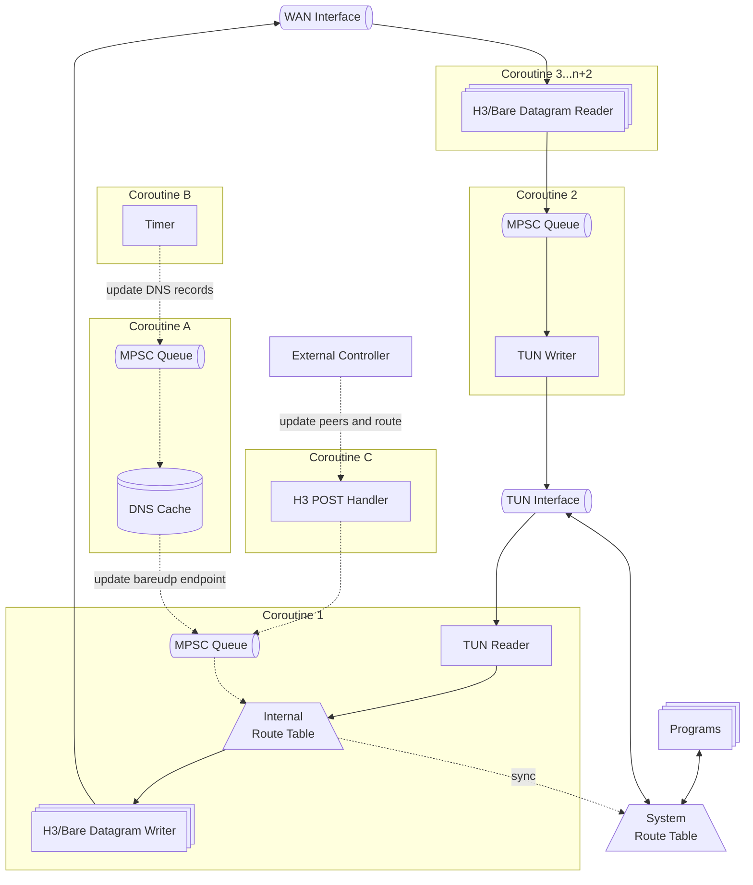

## Internals

### Dependencies

h3llo primarily depends on tun-rs and Cloudflare's tokio-quiche.

### Recursive Routing

Because h3llo takes over the system routing table and switches the default route so that all outbound traffic goes to the TUN interface, HTTP/3 connections to peers might be routed back into the TUN instead of out the WAN interface—i.e., a recursive routing problem.

h3llo prevents this by forcing the UDP socket used by the HTTP/3 dialer to bind to the WAN interface. This should work on Linux, Darwin, and Windows.

Whenever an HTTP/3 connection (or reconnection) is created, h3llo should perform:

1. DNS resolution. To handle possible network interruptions during connection setup (especially reconnects), h3llo should cache DNS results for endpoints and refresh an entry immediately after it expires. Before the first connection, resolve and cache all endpoint hostnames before changing the default route.
2. Probe the WAN interface name. On each platform, run the corresponding command (such as `ip route show match <ip>`) to discover the interface originally used to reach the endpoint IPs, excluding the TUN interface.
3. Force the UDP socket for HTTP/3 to bind to the detected WAN interface, using options such as `SO_BINDTODEVICE`, `IP_UNICAST_IF`, or `IP_BOUND_IF`.

### Thread Model

h3llo uses the tokio runtime to schedule coroutines, and should rely on MPSC queues instead of locks to reduce async complexity, since MPSC queues explicitly linearize async operations.

Create a coroutine for every I/O reader to drive the program. For example, when multiple peers exist, multiple HTTP/3 connections are created; each connection should have its own coroutine dedicated to I/O reads.

On the control plane, when an external controller sends a POST request or during initialization, update the internal routing table first, then the system routing table. When connecting to new peers, establish HTTP/3 connections and spawn new coroutines to receive datagrams from those connections.

On the data plane, when sending IP packets, find the target peer’s HTTP/3 connection through the internal routing table. When receiving IP packets, write them into Coroutine 2’s MPSC queue to keep writes to the TUN interface thread-safe.

Additionally, a coroutine should act as a mini-service to maintain the DNS cache in the background, handling timer events via an MPSC queue or DNS requests from Coroutine 1 during connection setup.

### System Route Updates

h3llo should update individual routes without interruptions by executing system commands—such as `ip route replace` on Linux—and provide a simple cross-platform abstraction.

### Longest-Prefix-Match Algorithm

h3llo should use the same longest-prefix-match algorithm as WireGuard when matching entries in the internal routing table.
