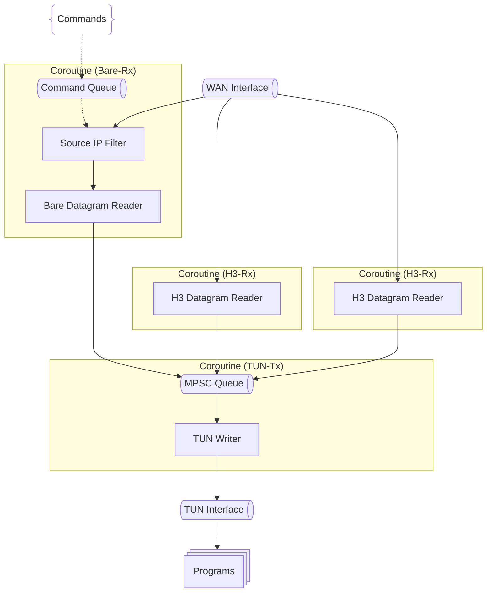
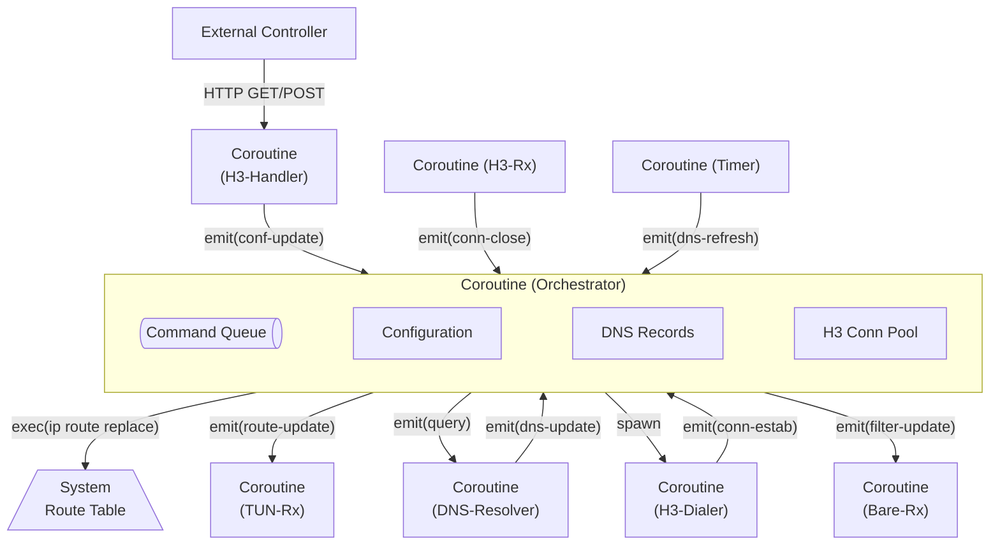

## Internals

Internals overview: runtime dependencies, guards against recursive routing and DNS resolution loops, coroutine layout for packet flow, route update strategy, and longest-prefix matching.

### Dependencies

h3llo primarily depends on tun-rs and Cloudflare's tokio-quiche (HTTP/3 with DATAGRAM support enabled).

### Recursive Routing and DNS Resolution

Recursive routing and DNS resolution summary: probe WAN-facing interfaces while excluding the TUN for both the DNS resolver and each resolved endpoint IP; bind per-transport sockets (HTTP/3, BareUDP, DNS) to the matching interface to avoid tunneling loops.

Because h3llo can redirect the default route into the TUN, outbound sockets might otherwise loop back through the tunnel. h3llo avoids this by consistently probing interfaces and binding sockets per destination.

Binding workflow for HTTP/3, BareUDP, and DNS:
1. Probe the default route to `local.dns` (e.g., `ip route show match <local.dns>`) excluding the TUN to pick the WAN-facing interface for DNS.
2. Bind a DNS UDP socket to that interface via `SO_BINDTODEVICE`, `IP_UNICAST_IF`, or `IP_BOUND_IF`, then resolve peer endpoints through `local.dns` (default `1.1.1.1`). BareUDP only accepts a single IP and panics on multiple answers; HTTP/3 keeps the first IP. DNS rotation only happens when reconnects trigger re-resolution.
3. For each endpoint IP, probe the WAN-facing interface (e.g., `ip route show match <endpoint IP>`) excluding the TUN; bind each transport socket to that interface with the same method. Every HTTP/3 connect or reconnect re-resolves before binding its QUIC UDP socket to the chosen IP; each BareUDP socket binds per endpoint. Transport sockets stay separate from the DNS socket and from each other.

### Thread Model

Thread model overview: h3llo schedules a coroutine per I/O source (TUN, each HTTP/3 connection, BareUDP endpoint) and uses MPSC queues to serialize cross-component communication; configuration updates flow from the controller into routing tables before affecting system routes.

**Inbound Datapath**

**Outbound Datapath**

**Control Path**

h3llo uses the tokio runtime to schedule coroutines and should rely on MPSC queues instead of locks to reduce async complexity, since MPSC queues explicitly linearize async operations.

Spawn a coroutine for every I/O reader to drive the program. With multiple peers, each HTTP/3 connection should own its read coroutine.

When configuration changes arrive (external controller POST or initialization), update the internal routing table first, then the system routing table. Connecting to new peers should establish HTTP/3 connections and spawn coroutines to receive datagrams from those connections.

During packet forwarding, look up the target peer’s HTTP/3 connection via the internal routing table. Enqueue received IP packets into Coroutine 2’s MPSC queue to keep TUN writes thread-safe.

Key flows:

- TUN Reader → internal route table lookup → H3/Bare datagram writer.
- H3/Bare datagram reader → queue → TUN Writer.
- Controller updates → internal routes → system routes.

### System Route Updates

Route update summary: replace per-route entries with platform commands while keeping traffic uninterrupted. Typical commands: `ip route replace` on Linux, `route -n add -net` / `route -n change` on Darwin, and `netsh interface ipv4 add route` on Windows.

h3llo updates individual routes best-effort: command failures log warnings and continue; retries piggyback on future config refreshes or reconnections. If the platform lacks a usable route update mechanism, h3llo logs a warning, skips the system-route change, and continues running.

### Longest-Prefix-Match Algorithm

LPM summary: reuse WireGuard’s longest-prefix-match behavior when choosing peers for IP packets.

h3llo should use the same longest-prefix-match algorithm as WireGuard when matching entries in the internal routing table.
