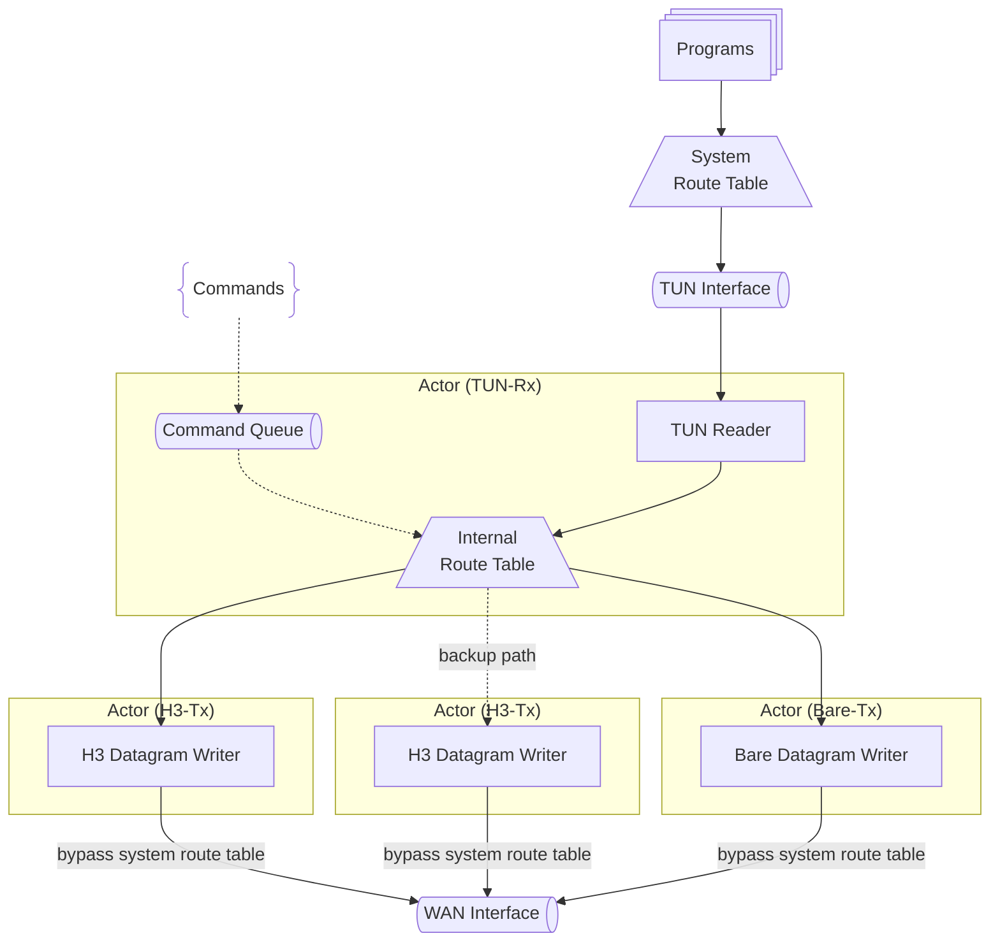
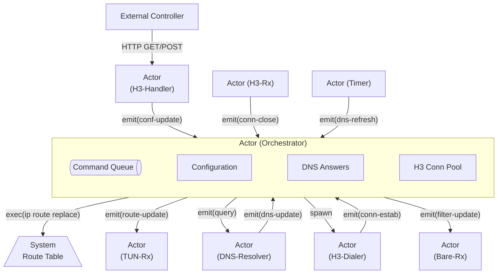

## Internals

Internals overview: runtime dependencies, guards against recursive routing and DNS resolution loops, actor-based concurrency model, route update strategy, and longest-prefix matching. Protocol/auth specifics live in `docs/protocol.md`.

### Dependencies

h3llo primarily depends on tun-rs and tokio-quiche (HTTP/3 with DATAGRAM support enabled). tokio-quiche is statically linkable and provides low-level control over QUIC connections.

### Recursive Routing and DNS Resolution

Recursive routing and DNS resolution summary: probe WAN-facing interfaces (excluding the TUN) for DNS, HTTP/3, and BareUDP, bind sockets per interface when possible, and warn loudly while falling back to unbound sockets if probing or binding fails (risking recursive routing when default routes are overridden).

Why recursive routing happens: if h3llo installs the default route into the TUN and outbound sockets (DNS, HTTP/3, BareUDP) are not explicitly bound to a WAN-facing interface, their traffic can re-enter the tunnel and get forwarded again, creating loops and blocking connectivity. Binding per interface (or at least warning on fallback to unbound) avoids the TUN from becoming both source and sink of control traffic.

Binding workflow for HTTP/3, BareUDP, and DNS:
1. Pick the DNS interface: prefer `local.dns.bindif` when provided and present in probe results; warn and fall back to the first probed non-TUN interface when the preferred one is missing. If no interface is available or probing fails, log a warning and continue with an unbound DNS socket. Probing uses `route_manager` to list routes, performs prefix matches against the target IP, filters entries whose `ifindex` matches the TUN, and maps interface indexes back to names; `route_manager` does not expose route metrics/priority, so ties with equal prefixes rely on route enumeration order—set `local.dns.bindif` / `peers[].h3.bindif` explicitly when interface preference matters.
2. DNS resolver actor: bind a UDP socket by interface index (Linux/macOS via `bind_device_by_index_v4/6`, Windows via `IP_UNICAST_IF` / `IPV6_UNICAST_IF`) when available. The actor runs a `select` over its command queue, UDP socket, a one-second timer tick, and a refresh timer (configurable via `local.dns.refresh`). The orchestrator sends a single `SetHostnames { hosts: HashSet<String> }` command with all peer endpoint hostnames; the DNS module owns hostname registration and refresh scheduling internally. For each hostname, the resolver assigns random unique transaction IDs for A and AAAA queries and tracks `(domain, id)` pairs. The resolver maintains unified internal state tracking each registered hostname's resolved IPs with TTL-based expiration (minimum 60 seconds). On state change (new IP, IP expired, hostname added/removed), the resolver sets a dirty flag and emits a state snapshot (`HashMap<String, Vec<IpAddr>>`) on the next tick. The orchestrator computes deltas by diffing the new snapshot against the previous one and applies adds/removes accordingly. DNS warnings (NXDOMAIN, truncation, recursion refusal) are logged at origin via `warn!` instead of propagating through events. Timer ticks re-send timed-out entries with new transaction IDs.
3. Transport binding: for each resolved IP, probe the WAN-facing interface excluding the TUN; bind transport sockets to that interface. HTTP/3 dials all DNS-resolved IPs in parallel; first successful connection wins. BareUDP uses a single listener socket (RX-only) and one outbound socket per BareUDP peer (TX-only). If probing or binding fails, warn and continue unbound.

Platform tiers and binding behavior:
- Linux (primary): uses `bind_device_by_index_v4` / `bind_device_by_index_v6` with `if_nametoindex` to pin sockets by interface index.
- macOS (second tier): same index-based binding as Linux; warnings on failures or missing interfaces fall back to unbound sockets.
- Windows (second tier): binds via `IP_UNICAST_IF` / `IPV6_UNICAST_IF` using interface index; failures degrade to unbound sockets with warnings.
- BSD (third tier): route probing and interface binding are not supported; h3llo will warn, avoid interface pinning, and cannot install or adjust routes automatically. Users must update the system route table manually to prevent recursive routing.

### Concurrency Model (Actor)

Concurrency model overview: h3llo adopts the actor model—each coroutine (actor) owns private state, communicates exclusively via MPSC message queues, and never shares mutable data with other actors. This eliminates lock contention and simplifies reasoning about concurrent correctness.

Actor design principles:
- **Isolated state**: each actor (TUN-Rx, TUN-Tx, DNS Resolver, BareUDP-Rx/Tx, Orchestrator, H3 connections) maintains its own state; no `Arc<Mutex<_>>` across actors.
- **Actor-owned message box**: each actor creates its own channels during spawn. Control-plane command channels use `mpsc::unbounded_channel()`; data-plane packet channels use `mpsc::channel(PACKET_QUEUE_DEPTH)`. The actor owns the receiver; the caller receives the sender via tuple return (e.g., `(cmd_tx, JoinHandle)` or `(packet_tx, JoinHandle)`). This ensures clear ownership and enables graceful shutdown when all senders are dropped.
- **Message passing**: actors communicate through typed `mpsc::channel` queues; the `Event` enum and command types define the message protocol.
- **Async select loop**: each actor runs a `tokio::select!` loop over its input channels, I/O sources, and timers.
- **Supervision**: the Orchestrator holds senders to child actors; task JoinHandles are registered with `JoinSet` for lifecycle monitoring. Actors return `ActorExitResult`:
  - `Ok(())` for graceful shutdown (e.g., command channel closed)
  - `Err(ActorError)` for I/O errors requiring orchestrator action
  The orchestrator continues running on graceful exits but terminates on actor errors or task panics.
- **Graceful shutdown**: when all senders to an actor's command channel are dropped, `recv()` returns `None`. The actor detects this and exits its event loop gracefully.

#### Actor Initialization Pattern (make + spawn)

Each actor follows a consistent two-function initialization pattern:

1. **`make_*`** - Creates actor state from configuration:
   - Takes configuration parameters (structured config or resolved types)
   - Performs synchronous or fallible I/O (socket binding, parsing)
   - Returns `Result<ActorState, Error>`
   - Example: `make_bare_rx(listen: SocketAddr, mtu: usize) -> Result<BareUdpRx, UdpError>`

2. **`spawn_*`** - Spawns the actor task:
   - Takes the state struct and dependencies (events_tx, etc.)
   - Creates channels internally (actor owns receiver)
   - Spawns `tokio::spawn` task
   - Returns `(Sender, JoinHandle)`
   - Example: `spawn_udp_rx(rx: BareUdpRx, ...) -> (UnboundedSender<Cmd>, JoinHandle)`

Both `make` and `spawn` are **bare functions** (not associated methods or impl methods). This design:
- Follows [Alice Ryhl's Tokio actor pattern](https://ryhl.io/blog/actors-with-tokio/) recommendation for fewer lifetime issues
- Keeps initialization logic in the actor module, not scattered in orchestrator
- Makes the separation between fallible setup (`make`) and task spawning (`spawn`) explicit

The orchestrator calls `make` then `spawn` sequentially, never performs actor-specific socket/device initialization.

#### Channel Capacity Policy

Actors use two channel categories with different capacity policies:

- **Control plane (unbounded)**: Command queues (orchestrator-to-child) and event queues (child-to-orchestrator) use `mpsc::unbounded_channel()`. This prevents deadlocks from message cycles between actors—a bounded channel can deadlock when actors block on `send()` waiting for each other.
- **Data plane (bounded)**: Packet queues for forwarding IP datagrams use `mpsc::channel(PACKET_QUEUE_DEPTH)` with `PACKET_QUEUE_DEPTH = 256`. Bounded channels provide backpressure, preventing memory exhaustion when producers outpace consumers.

Reference: [Alice Ryhl - Actors with Tokio](https://ryhl.io/blog/actors-with-tokio/)

**Inbound Datapath**

**Outbound Datapath**

**Control Path**

h3llo uses the tokio runtime to schedule actors and relies on MPSC queues instead of locks, since message passing explicitly linearizes async operations and avoids shared mutable state.

Orchestrator responsibilities and invariants:
- Maintain the latest configuration snapshot and H3 connection pool; receive commands from other actors through its MPSC queue.
- Stay fully async: handle config updates, DNS refresh results, connection close notifications, and timer ticks without blocking other commands.
- Spawn child actors (DNS resolver, H3 dialers) and push newly established H3 connections to the TUN-Rx actor for routing decisions. The DNS resolver is a long-lived child actor that joins the orchestrator's JoinSet.
- Process events from child actors (metrics, DNS) and log them appropriately; child actors control their own metric emission timing.
- Handle graceful shutdown on `ctrl_c` signal; task exit errors include task labels for debugging.

Orchestrator DNS handling:
- **Single event loop**: The orchestrator runs one unified event loop that handles all events including DNS lifecycle events. There is no separate initialization event loop.
- **Listen hostname**: If the listen address is a hostname (not IP literal), perform synchronous DNS lookup before starting the event loop. This ensures BareUDP RX and TUN TX are created immediately.
- **Unified hostname registration**: The orchestrator sends a single `SetHostnames { hosts: HashSet<String> }` command at startup with all unique peer endpoint hostnames. IP literals are handled by the DNS module directly (recorded with max TTL, included in next snapshot). The DNS module owns hostname tracking, refresh scheduling, and TTL-based expiration internally.
- **Event-driven IP lifecycle**: The orchestrator reacts to DNS state snapshot events. When a snapshot arrives, the orchestrator iterates over all peers to check connection state and IP validity. For unbound peers, available IPs trigger TX actor creation (BareUDP) or dial attempts (H3); for bound peers, IP expiration triggers bound removal. The `bare_accepted_ips` set is computed on-demand from the snapshot rather than maintained incrementally.
- **First IP wins**: For peer endpoints, use the first resolved IP for outbound traffic. All resolved IPs are added to the accepted source filter.

Spawn an actor for every I/O reader (TUN-Rx, TUN-Tx, each H3 connection, BareUDP, DNS resolver). Each H3 connection owns its own Rx actor; BareUDP owns one listener socket for RX and a separate TX-only socket per BareUDP peer.

When configuration changes arrive (external controller POST or initialization), update the accepted-source filter first (fast, in-memory), then the internal routing table, then the system routing table. Dynamic reconfiguration flows through the orchestrator via command queues.

**Terminology**: "Accepted sources" refers to the BareUDP RX source IP filter. "Allowed IPs" refers to TUN routing prefixes (`peers[].tun.allowedIPs`).

H3 connection management:
- For each peer, dial all DNS-resolved IPs in parallel when a new IP is resolved and no connection exists.
- First successful connection wins and becomes the active connection for the peer.
- When the active connection disconnects or its IP expires, the connection is removed. Reconnection is not yet implemented.
- Each peer has at most one active connection at any time.

DNS lifecycle management:
- The DNS module owns the refresh timer internally; every `local.dns.refresh` seconds (when nonzero), it re-queries all registered hostnames.
- The DNS module maintains unified state tracking each hostname's resolved IPs with TTL-based expiration (minimum 60 seconds). A dirty flag tracks whether state changed since the last snapshot emission.
- On any state change (new IP, IP expiration, hostname add/remove), the dirty flag is set. On the next tick, if dirty, the DNS module emits a single state snapshot containing all hostname→IP mappings and clears the flag.
- The orchestrator iterates over all peers when a snapshot arrives:
  - For each peer, check the endpoint hostname against the new snapshot
  - If no active connection: create connection using first available IP (BareUDP) or dial all IPs (H3)
  - If active connection exists: check if destination IP is still in the snapshot for that hostname
    - If expired: remove bound and immediately attempt reconnection if new IPs available
    - If still valid: do nothing
  - After processing all peers:
    - Always update accepted-source filter (DNS may resolve new IPs without bounds change)
    - Update routing only when bounds actually changed (new connections or disconnections)
- Refreshing an existing IP extends its TTL without changing the snapshot (no duplicate events).
- DNS warnings (NXDOMAIN, truncation, recursion refusal) are logged via `warn!` at the DNS module (origin) rather than propagating through events.

During packet forwarding, TUN-Rx performs inline routing dispatch: it extracts the destination IP from each packet, performs routing table lookup, and directly forwards packets to the appropriate peer's TX channel (H3 or BareUDP writer). This eliminates an intermediate dispatch actor and MPSC queue hop that would otherwise exist between TUN-Rx and peer TX channels. For inbound traffic, received IP packets are enqueued into the TUN-Tx queue to keep TUN writes thread-safe.

Key flows:

- TUN Reader → inline routing dispatch (dest IP extraction + route lookup) → H3/Bare datagram writer.
- H3/Bare datagram reader → queue → TUN Writer.
- Controller updates → internal routes → system routes.

### System Route Updates

Route update summary: keep the TUN interface’s routes aligned with `peers[].tun.allowedIPs` using `route_manager` APIs instead of shelling out (`ip route`, `route`, `netsh`). Flow: (1) resolve the TUN ifindex, (2) list system routes, (3) drop stale TUN routes that are not covered by `allowedIPs` while preserving the configured TUN host addresses, (4) rely on exact prefix matches instead of aggregated coverage when deciding whether an `allowedIPs` entry already exists, (5) when `allowedIPs` includes a default route, split it into two `/1` entries (IPv4 and IPv6) once and warn about the split; if either `/1` conflicts with another interface, emit a conflict warning but still attempt to add the route without further splitting, and (6) warn on unsupported route entries or add/delete failures while continuing to run. If the platform lacks `route_manager` support, h3llo logs a warning, skips system-route changes, and continues running.

### Longest-Prefix-Match Algorithm

LPM summary: reuse WireGuard’s longest-prefix-match behavior when choosing peers for IP packets.

h3llo should use the same longest-prefix-match algorithm as WireGuard when matching entries in the internal routing table.

### Observability

Observability summary: interface loops emit cumulative metrics (packets/bytes, drops, and drop-reason breakdowns) on a timer; the orchestrator owns periodic reporting and change detection.

- Metric shape: every emit carries labels `{kind: Tun|BareUdp|Http3, direction: Rx|Tx, peer_id?: string, ip_addr?: IP}` plus total succeeded and dropped counters and a drop-reason map keyed by `DropReason` (e.g., `Oversize`, `DisallowedSource`, `SendError`, `ChannelClosed`).
- Drop accounting: TUN TX counts oversize and send failures; TUN RX counts channel-closed drops when forwarding to the writer queue fails; BareUDP RX counts disallowed sources; BareUDP TX counts send failures. All counters saturate to avoid panics.
- Reporting: only the orchestrator prints periodic drop summaries (when counters change); transport loops stay silent, including oversized TUN drops.

### Logging and Warning Handling

Logging summary: h3llo uses the `tracing` crate for structured logging. Warnings are logged directly at origin points rather than propagated through return values.

Warning handling design principles:
- **Log at origin**: Modules log warnings directly via `warn!` at the point where the condition is detected, using structured fields for context (e.g., `warn!(prefix = %net, error = %err, "route add failed")`).
- **No warning enums for logging**: Warning enums like `BindWarning` and `RouteSyncWarning` have been removed in favor of direct logging. This simplifies function signatures and eliminates boilerplate warning propagation code.
- **DNS warnings logged at origin**: The DNS module logs warnings (NXDOMAIN, truncation, recursion refusal) directly via `warn!` instead of propagating them through events. This follows the "log at origin" principle and simplifies event handling.
- **Structured fields**: Warning logs include structured fields (`prefix`, `interface`, `error`, `host`, etc.) to enable filtering and analysis in log aggregation systems.
- **Test assertions**: Tests use `tracing-test` with `#[traced_test]` and `logs_contain()` to verify that expected warnings are logged.

Unhandled event logging policy:
- **Log at wildcard**: All match statements on event enums (e.g., `ServerH3Event`, `ClientH3Event`, `Event`) must log unhandled variants at `debug!` level instead of silently continuing. This ensures that new event types introduced by library updates (such as `tokio-quiche`) are visible during troubleshooting.
- **Named binding**: Use `other => { debug!(..., event = ?other, ...); }` instead of `_ => continue`. The named binding enables Debug formatting in the log message.
- **Structured context**: Include relevant context fields (e.g., `%remote_addr`, `%peer_id`) to aid debugging.
- **Rationale**: External library enums like `ServerH3Event` and `ClientH3Event` may be `#[non_exhaustive]` or evolve over time. Silent wildcards mask missing handler code that should be added when new variants appear.
- **Log level choice**: `debug!` is chosen over `warn!` because unhandled events like `IncomingSettings` or `StreamClosed` are expected during normal operation and do not indicate hazardous situations (per standard logging conventions from [docs.rs/log](https://docs.rs/log/latest/log/enum.Level.html)).
