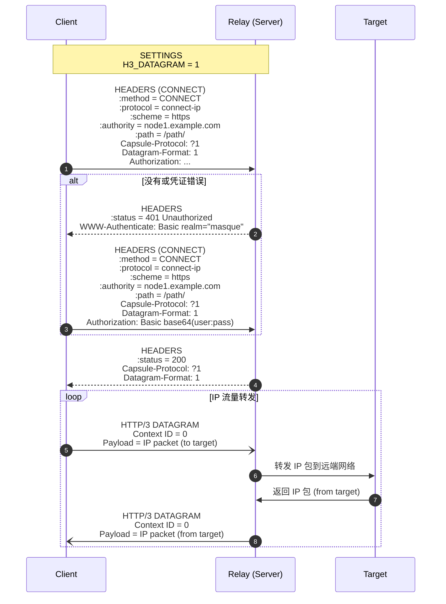

## 协议

h3llo使用HTTP Basic Auth进行身份验证和MASQUE/CONNECT-IP（[RFC 9484](https://datatracker.ietf.org/doc/html/rfc9484)）协议的子集封装IP报文并传输到对端。

### 认证

在HTTP3请求发起方（客户端）请求URI指定的HTTP Path时，请求接收方（服务端）将对客户端进行HTTP Basic Auth。客户端需要发送客户端的UUID作为用户名，以及服务端的UUID作为密码，然后由服务端校验用户名和密码。

服务端在验证失败时要求重新进行HTTP Basic Auth。客户端在等待一段时间后（默认5秒）尝试重新连接。

### 控制面：动态重配置

对h3llo的HTTP Path进行POST操作，向h3llo发送仅包含`peers`这一个key的完整yaml配置，即可动态批量更新peers以及路由（包括系统路由和h3llo内部路由）。

h3llo的动态重配置被设计为是无中断的。具体来说，peers和内部路由的更新是原子性的，更新将应用于之后所有的outgoing的IP报文，同时h3llo不主动关闭到已移除peers的连接直至该连接的自然中断，以排空该连接上所有in-flight的报文。系统路由的更新不保证原子性，仅保证无中断。

### 数据面：CONNECT-IP协议

对h3llo的HTTP Path进行Extended CONNECT操作即使用标准CONNECT-IP协议传输IP报文。

h3llo仅实现了CONNECT-IP协议的必须的部分：

- HTTP/3下的connect-ip语义
- Context ID（始终为0）

当前h3llo选择放弃实现RFC 9484标准的以下可选功能：

- HTTP/2和HTTP/1.1的回退：标准的回退方案会引发TCP over TCP的问题，导致延迟和吞吐的表现严重退化。
- 所有的Capsule Types。由于h3llo已在配置文件中静态配置了IP地址和路由，因此不需要通过`ROUTE_ADVERTISEMENT`，`ADDRESS_REQUEST`和`ADDRESS_ASSIGN`来动态分配IP地址和指派路由。
- URI的`target`和`ipproto`模板路径

