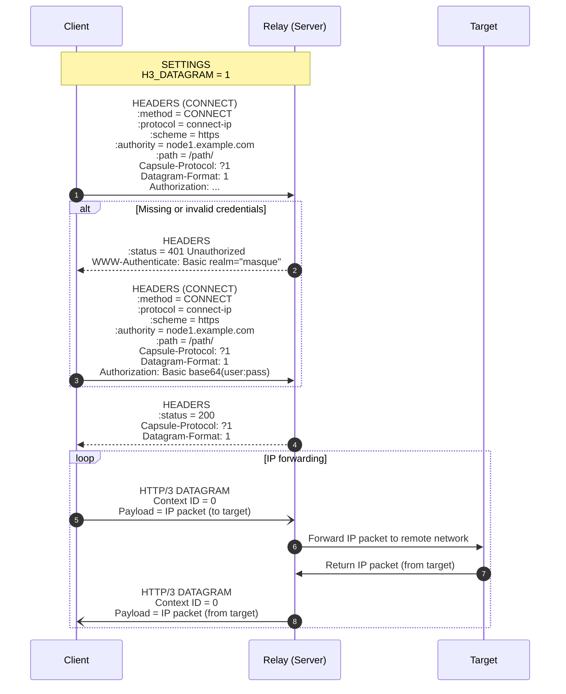

## Protocol

Protocol overview: HTTP Basic Auth with ID pairs, HTTP/3 CONNECT-IP as the encrypted default path, BareUDP as an optional fast path (details TBD), and POST-driven peer refresh on the HTTP path.

h3llo uses HTTP Basic Auth for authentication and a subset of MASQUE/CONNECT-IP ([RFC 9484](https://datatracker.ietf.org/doc/html/rfc9484)) to encapsulate IP packets and deliver them to peers.

### Authentication

Authentication summary: clients present `id` pairs via HTTP Basic Auth on the configured path; servers check that the username exists in `peers[].id` and that the password matches the server’s `local.id`. CONNECT, GET, and POST all share the same HTTP path and all require Basic Auth; HTTP requests do not apply source-IP filtering (unlike BareUDP).

When the HTTP/3 initiator (client) requests the configured HTTP path, the receiver (server) performs HTTP Basic Auth. For CONNECT-IP, the client sends `username = client local.id` and `password = server local.id`; the server validates the username against `peers[].id` and the password against its own `local.id`. For GET/POST on the same path, set both `username` and `password` to the target server’s `local.id`.

On authentication failure, the server requests Basic Auth again. The client waits for a period (default 5 seconds) before attempting to reconnect.

### HTTP/3 Transport (CONNECT-IP)

HTTP/3 summary: h3llo speaks CONNECT-IP over HTTP/3 with datagrams enabled; only mandatory pieces stay to minimize latency and complexity.

Issuing an Extended CONNECT request to h3llo’s HTTP path uses the standard CONNECT-IP protocol to transport IP packets.

h3llo implements only the mandatory pieces of CONNECT-IP:

- connect-ip semantics over HTTP/3
- Context ID (always 0)

h3llo intentionally omits the following optional features from RFC 9484:

- HTTP/2 and HTTP/1.1 fallback: the standard fallback causes TCP-over-TCP, severely degrading latency and throughput.
- All Capsule Types: IP addresses and routes are statically configured, so `ROUTE_ADVERTISEMENT`, `ADDRESS_REQUEST`, and `ADDRESS_ASSIGN` are unnecessary.
- URI template parameters `target` and `ipproto`.



### BareUDP Transport (TBD)

BareUDP summary: plaintext fast path for trusted networks; not NAT-friendly and requires mutually reachable static IPs. DNS resolution runs once; if it returns multiple IPs, h3llo panics. h3llo does not watch for DNS rotation after startup (undefined behavior).

BareUDP moves IP packets without extra framing: each IP packet read from the TUN becomes the UDP payload sent to the peer’s BareUDP listener, and the listener injects the payload directly into its TUN device. BareUDP only runs when `local.bare.listen` is configured on the node.

- Encapsulation: The sender copies the raw IP packet from the TUN and uses it as the UDP payload to the peer’s `peers[].bare.endpoint`; there is no handshake or session setup.
- Receive path: The BareUDP listener accepts the UDP payload and writes it directly to the TUN as an IP packet, without reassembly or additional validation.
- Security model: BareUDP performs no encryption or authentication. The listener filters by the UDP source IP, dropping packets whose source IP does not match configured BareUDP peer endpoints. Because source IPs can be spoofed, avoid exposing BareUDP to the public Internet and prefer HTTP/3 whenever confidentiality or peer authenticity is required. BareUDP does not attempt NAT traversal.

### Datagram Formats

Datagram format summary: HTTP/3 CONNECT-IP wraps inner IP packets in QUIC DATAGRAM frames with Context ID 0; BareUDP sends the inner IP packet as the UDP payload with only the outer IP/UDP headers.

#### HTTP/3 CONNECT-IP Datagram Layout

CONNECT-IP over HTTP/3 uses QUIC DATAGRAM frames with Context ID set to `0`; no additional MASQUE headers or capsules are present.

[Outer IP Header; (v4)20B/(v6)40B]
[Outer UDP Header; 8B]
[QUIC Short Header; 2-25B]
[QUIC Datagram Frame Header; 1-9B]
[H3 Datagram Header (Context ID); 1-8B]
[Inner IP Packet]

- Outer IP header: IPv4 is 20 bytes; IPv6 is 40 bytes.
- Outer UDP header: always 8 bytes.
- QUIC Short header: 2-25 bytes depending on connection ID length, packet number length, and spin/reserved bits.
- QUIC DATAGRAM frame header: 1-9 bytes depending on length encoding and whether DATAGRAM length is present.
- H3 datagram header: MASQUE Context ID varint; Context ID `0` encodes to a single byte (`0x00`).
- Payload: the inner IP packet read from the TUN (IPv4 or IPv6).

#### BareUDP Datagram Layout

BareUDP sends the inner IP packet directly as the UDP payload; there is no QUIC or MASQUE framing.

[Outer IP Header; (v4)20B/(v6)40B]
[Outer UDP Header; 8B]
[Inner IP Packet]

- Outer headers: IPv4 is 20 bytes; IPv6 is 40 bytes; UDP is 8 bytes.
- Payload: raw IP packet from the TUN; the receiver injects it unchanged into the local TUN.

#### MTU Guidance

MTU summary: pick the lowest MTU across transports using IPv4/IPv6 figures per endpoint’s resolved family; default `1410` is safe for IPv6 CONNECT-IP, IPv4-only CONNECT-IP can go higher, BareUDP-only can go higher still, and mixed H3/BareUDP should stick to the H3 lower bound.

- CONNECT-IP overhead: 20/40 (outer IP) + 8 (UDP) + 25 (max QUIC Short) + 9 (max DATAGRAM frame) + 8 (max H3 datagram Context ID) = 70/90 bytes.
    - With WAN MTU 1500: TUN MTU up to 1500 - 70 = 1430 (IPv4) and 1500 - 90 = 1410 (IPv6).
- BareUDP overhead: 20/40 (outer IP) + 8 (UDP) = 28/48 bytes.
    - with WAN MTU 1500 and only BareUDP peers: TUN MTU up to 1472 (IPv4) and 1452 (IPv6).

Address family: the IPv4/IPv6 values above depend on the resolved address family of each endpoint; use the IPv4 numbers for IPv4 endpoints and the IPv6 numbers for IPv6 endpoints, then pick the lowest applicable MTU across peers.

### Dynamic Reconfiguration

Reconfiguration summary: `GET` returns the current configuration, and `POST` accepts partial `peers` updates that apply atomically to internal routes first, then update system routes without dropping active traffic.

`GET https://node1.example.com:443/path` returns the full configuration snapshot in YAML, matching the shape documented in `docs/configuration.md`, and requires Basic Auth with both credentials set to the server’s `local.id`.

`POST https://node1.example.com:443/path` accepts YAML containing only the `peers` key and merges entries by `peers[].id`. Omitted fields stay unchanged; send only the fields you intend to modify. Basic Auth is mandatory on the same HTTP path; set `username = server local.id` and `password = server local.id`.

Update rules:
- `enabled`, `h3`, `bare`, and `tun` fields can be combined in one update; keep the one-transport rule so only one of `peers[].h3` or `peers[].bare` is present after the merge.
- Use `null` to remove optional transport blocks (`peers[].h3` or `peers[].bare`); other fields clear only when explicitly overwritten.
- Route refresh is zero-downtime: internal route tables update atomically; existing traffic to removed peers drains naturally; system route updates are applied without intentional interruption but may not be atomic.
- If an update payload includes `peers[].h3.endpoint`, h3llo re-resolves the endpoint and rebuilds the HTTP/3 connection even when the endpoint string is unchanged; HTTP/3 accepts multiple DNS answers and dials the first. The old connection keeps forwarding until the new one is ready, then TUN traffic naturally shifts to the new HTTP/3 datagram writer.
- If an update payload includes `peers[].bare.endpoint`, the BareUDP source-IP filter refreshes and re-resolves the endpoint even when the endpoint value does not change.

Examples:
```yaml
# GET returns the current configuration
local:
  id: example-node-01
  ...
peers:
- id: example-node-02
  ...

# POST partial update: disable a peer
peers:
- id: example-node-01
  enabled: false

# POST partial update: enable H3 with custom trust
peers:
- id: example-node-01
  enabled: true
  h3:
    endpoint: https://node1.example.com:443/path
    ca: ./ca.pem
    insecure: false

# POST partial update: switch to BareUDP (null clears H3)
peers:
- id: example-node-01
  enabled: true
  h3: null
  bare:
    endpoint: udp://node1.example.com:6635
```
