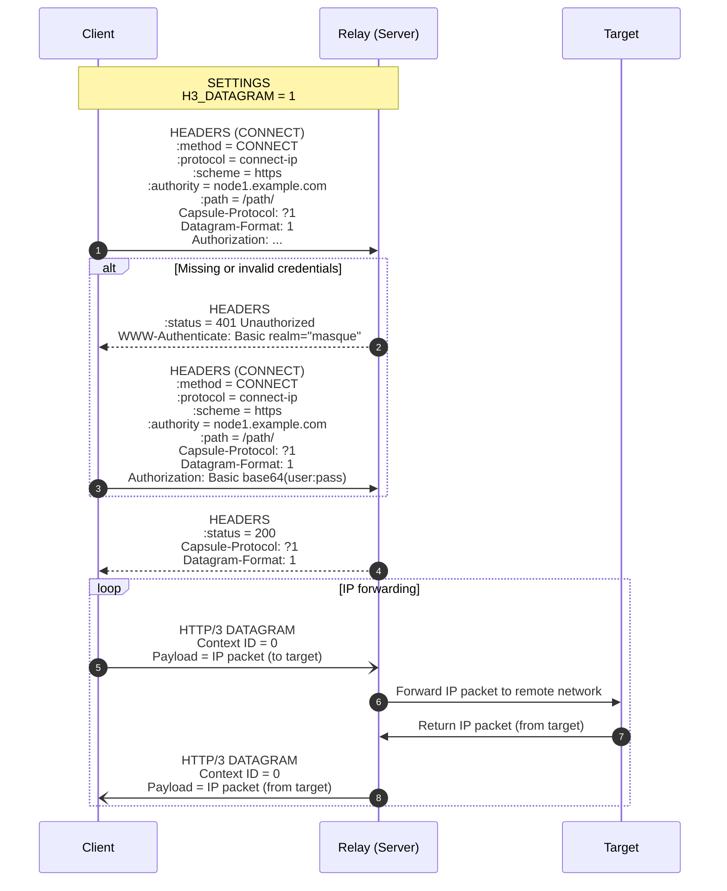

## Protocol

Protocol overview: HTTP Basic Auth with UUID pairs, HTTP/3 CONNECT-IP as the encrypted default path, BareUDP as an optional fast path (details TBD), and POST-driven peer refresh on the HTTP path.

h3llo uses HTTP Basic Auth for authentication and a subset of MASQUE/CONNECT-IP ([RFC 9484](https://datatracker.ietf.org/doc/html/rfc9484)) to encapsulate IP packets and deliver them to peers.

### Authentication

Authentication summary: clients present `uuid` pairs via HTTP Basic Auth on the configured path; servers validate the client UUID and the expected server UUID before allowing CONNECT-IP.

When the HTTP/3 initiator (client) requests the configured HTTP path, the receiver (server) performs HTTP Basic Auth. The client sends its own UUID as the username and the server’s UUID as the password, and the server validates both.

On authentication failure, the server requests Basic Auth again. The client waits for a period (default 5 seconds) before attempting to reconnect.

### HTTP/3 Transport (CONNECT-IP)

HTTP/3 summary: h3llo speaks CONNECT-IP over HTTP/3 with datagrams enabled; only mandatory pieces stay to minimize latency and complexity.

Issuing an Extended CONNECT request to h3llo’s HTTP path uses the standard CONNECT-IP protocol to transport IP packets.

h3llo implements only the mandatory pieces of CONNECT-IP:

- connect-ip semantics over HTTP/3
- Context ID (always 0)

h3llo intentionally omits the following optional features from RFC 9484:

- HTTP/2 and HTTP/1.1 fallback: the standard fallback causes TCP-over-TCP, severely degrading latency and throughput.
- All Capsule Types: IP addresses and routes are statically configured, so `ROUTE_ADVERTISEMENT`, `ADDRESS_REQUEST`, and `ADDRESS_ASSIGN` are unnecessary.
- URI template parameters `target` and `ipproto`.

### BareUDP Transport (TBD)

BareUDP summary: plaintext fast path for trusted networks; mechanics are pending.

- TBD: handshake or session setup, if any.
- TBD: datagram encapsulation format and mapping from peers to UDP endpoints.
- TBD: security constraints and when BareUDP should be preferred or avoided relative to HTTP/3.

### Dynamic Reconfiguration

Reconfiguration summary: POST-only peer refreshes apply atomically to internal routes first, then update system routes without dropping active traffic.

POSTing to h3llo’s HTTP path with a YAML body containing only the `peers` key refreshes peers and routes (both system and h3llo internal routes).

Dynamic reconfiguration targets zero downtime: internal route updates are atomic and affect all subsequent packets; existing connections for removed peers drain naturally instead of being actively closed. System route updates are not guaranteed to be atomic but are applied without intentional interruption.
